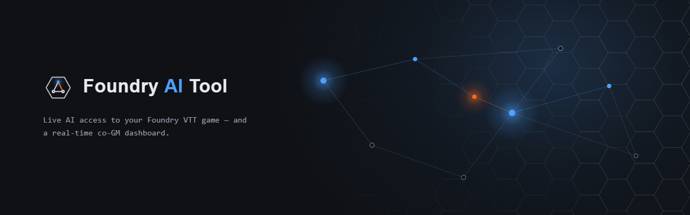

<!-- ════════════════════════════════════════════════════════════════════════
     BRAND SLOT — drop a hero banner here once generated (see docs/BRAND-BRIEF.md).
     When you have the asset, replace this comment block with:
       <p align="center"></p>
     Until then the text hero below stands on its own (no broken image).
════════════════════════════════════════════════════════════════════════ -->

<h1 align="center">Foundry AI Tool</h1>

<p align="center">
  <strong>Give AI models live access to your Foundry VTT session —<br/>
  and run the game from a real-time co-GM dashboard.</strong>
</p>

<p align="center">
  <a href="https://github.com/Gnuminator/Foundry-VTT-MCP-Ai-Tool/actions/workflows/ci.yml"></a>
  <a href="https://github.com/Gnuminator/Foundry-VTT-MCP-Ai-Tool/releases/latest"></a>
  <a href="LICENSE"></a>
  
  
</p>

---

Foundry AI Tool turns a live Foundry VTT game into something an AI can **see and act on** — and gives
you a browser **co-GM dashboard** that watches the table in real time and lets you drive it.

Point Claude Desktop (or any [MCP](https://modelcontextprotocol.io) client) at it and the AI gets
direct, GM-gated access to actors, combat, scenes, compendiums, journals, and more. Open the co-GM
dashboard on a second screen and you get a live combat tracker, a streaming AI co-GM, and a tool
runner for every bridge action — **no AI client required** to use it.

## The three parts

| Part                                      | What it is                                                                                   | Runs in           |
| ----------------------------------------- | -------------------------------------------------------------------------------------------- | ----------------- |
| **Foundry module** (`foundry-mcp-bridge`) | A GM-gated gateway inside Foundry that exposes game state + actions over a socket            | Foundry's browser |
| **MCP server**                            | Translates the bridge into Model Context Protocol tools for Claude / any MCP client          | Node.js           |
| **Co-GM dashboard**                       | A standalone browser control surface — live feed, combat tracker, AI commentary, tool runner | Node.js + browser |

```
  Claude / MCP client ──(MCP)──► MCP server ──(socket)──► Foundry module ──► your game
                                     ▲
   Co-GM dashboard ──(control channel)┘   ← watches + drives the same bridge, no AI client needed
```

> Architecture deep-dive: **[docs/ARCHITECTURE.md](docs/ARCHITECTURE.md)**.

---

## Co-GM Dashboard

The standout part of the project: a live session control surface that runs in a browser tab or on a
tablet beside your table.


- **Live combat tracker** — initiative order, current turn, HP bars, conditions, and death saves, in real time
- **Live event feed** — damage, healing, deaths, conditions, spell slots, color-coded as they happen
- **AI commentary** — streaming tactical/narrative call-outs on significant beats; ask questions grounded in the current board state
- **Whisper to chat** — push any comment into Foundry as a GM whisper in one click


**Run the game from the dashboard** — multi-select combatants and act as a group: roll initiative for
NPCs, advance the turn, jump to a combatant, apply damage/healing, roll saving throws.


**Tool Runner** — every Foundry MCP tool behind a searchable, categorized form: spawn NPCs from
compendiums, generate AI battlemaps, set scene mood/lighting, create quest journals, drop loot, manage
tokens, and more.


**Safe by default** — watching is always read-only; game-changing actions stay off until you flip the
**GM Actions** switch; every write asks for confirmation, and destructive actions need a second confirm.

> Full dashboard tour: **[docs/COGM-DASHBOARD.md](docs/COGM-DASHBOARD.md)**.

---

## Run it your way (remote-ready)

The bridge and dashboard are decoupled so you can run them however suits your table — local, headless,
or hosted for you **and** your GM.

- **Standalone bridge** — run the dashboard with **Claude Desktop closed**. The MCP backend can run as
  a long-lived process: `npm run bridge:standalone` (host/port injectable; Windows service scaffold in
  [`deploy/windows/`](deploy/windows/)).
- **Player vs GM split** — a read-only **`/player`** view alongside the full GM view, with GM-only data
  (exact enemy HP, hidden combatants, notes, diagnostics, the write surface) filtered **server-side**,
  not in CSS. Opt-in via a GM token or a Cloudflare Access email allow-list.
- **Remote access** — a setup guide + Cloudflare Tunnel / Access and Docker **templates** to host the
  dashboard for your group without exposing your home IP. See **[docs/REMOTE-ACCESS.md](docs/REMOTE-ACCESS.md)**
  and the **[Phase 6 design](docs/PHASE6-DESIGN.md)**. (Templated, not yet a one-click deploy.)

---

## MCP Tools

A selection of the tools, across 8 categories, exposed to any MCP-compatible AI client:

| Category        | Tools                                                                                         |
| --------------- | --------------------------------------------------------------------------------------------- |
| Character       | get-character, list-characters                                                                |
| Compendium      | search-compendium, get-compendium-item, list-creatures-by-criteria, list-compendium-packs     |
| Scene           | get-current-scene, get-world-info, list-scenes, switch-scene                                  |
| Actor creation  | create-actor-from-compendium, get-compendium-entry-full                                       |
| Quest / Journal | create-quest-journal, update-quest-journal, link-quest-to-npc, list-journals, search-journals |
| Campaign        | create-campaign-dashboard                                                                     |
| Ownership       | assign-actor-ownership, remove-actor-ownership, list-actor-ownership                          |
| Map generation  | generate-map, check-map-status, cancel-map-job                                                |

Map generation requires a local ComfyUI backend.

---

## Supported systems

- **Dungeons & Dragons 5th Edition**

Built for D&D 5e. System-specific logic (creature indexing, stat extraction, filters) lives behind a
registry + adapter interface, so another system is an adapter away — but only the D&D 5e adapter ships
today.

---

## Installation

### 1. Install the Foundry module

In Foundry VTT → **Add-on Modules → Install Module**, paste this manifest URL:

```
https://github.com/Gnuminator/Foundry-VTT-MCP-Ai-Tool/releases/latest/download/module.json
```

Enable it in your world (requires Foundry **v13** or **v14**).

### 2. Set up the MCP server

Requires Node.js 18+.

```bash
git clone https://github.com/Gnuminator/Foundry-VTT-MCP-Ai-Tool.git
cd Foundry-VTT-MCP-Ai-Tool
npm install
npm run build
```

Add the server to your Claude Desktop config (`claude_desktop_config.json`):

```json
{
  "mcpServers": {
    "foundry": {
      "command": "node",
      "args": ["/absolute/path/to/packages/mcp-server/dist/index.js"]
    }
  }
}
```

The server bridges the AI client and the in-Foundry module over local sockets (control channel on
`127.0.0.1:31414`; Foundry link on `31415`/`31416`). Foundry must be running with the module active.

### 3. Run the co-GM dashboard (optional)

```bash
cd packages/cogm-dashboard
cp .env.example .env          # optional: set ANTHROPIC_API_KEY to enable AI commentary
npm run dev                   # → http://localhost:3000
```

The dashboard works without an API key — live feed, combat tracker, and GM Actions all function; only
AI commentary needs one. To run it with Claude Desktop closed, start the bridge standalone first:
`npm run bridge:standalone`.

---

## Documentation

| Doc                                                     | What                                                                                |
| ------------------------------------------------------- | ----------------------------------------------------------------------------------- |
| [ARCHITECTURE.md](docs/ARCHITECTURE.md)                 | The system from first principles — the two wire contracts, GM-gating, the job queue |
| [COGM-DASHBOARD.md](docs/COGM-DASHBOARD.md)             | Full co-GM dashboard tour                                                           |
| [PHASE6-DESIGN.md](docs/PHASE6-DESIGN.md)               | Standalone bridge + remote access + player/GM split — design & roadmap              |
| [REMOTE-ACCESS.md](docs/REMOTE-ACCESS.md)               | Cloudflare Tunnel/Access setup guide + deploy templates                             |
| [MIGRATION.md](docs/MIGRATION.md)                       | Upgrading / repointing an existing install                                          |
| [CHANGELOG.md](CHANGELOG.md) · [CREDITS.md](CREDITS.md) | Releases · attribution                                                              |

---

## Attribution

Built on top of [foundry-vtt-mcp](https://github.com/adambdooley/foundry-vtt-mcp) by Adam Dooley (MIT).
The MCP server and Foundry module packages are derived from that upstream project; the co-GM dashboard
(`packages/cogm-dashboard`) is original work. Full attribution in [CREDITS.md](CREDITS.md).
