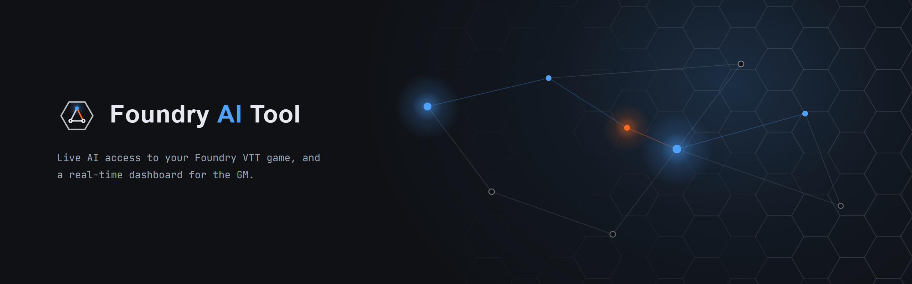
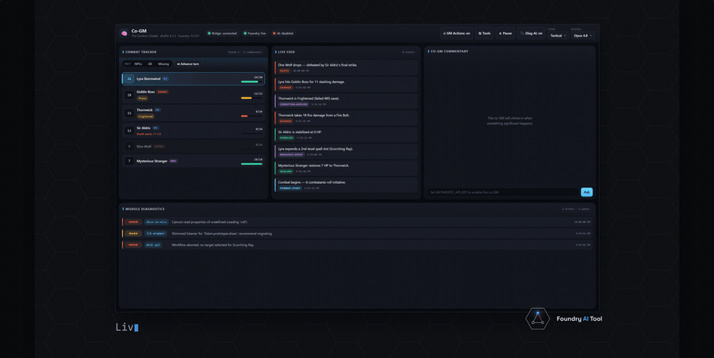
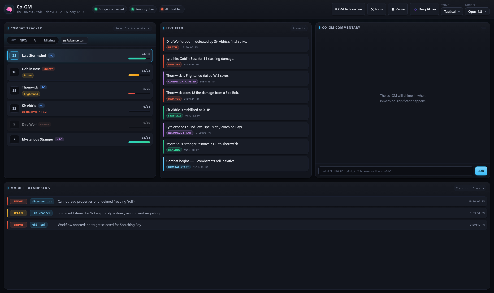
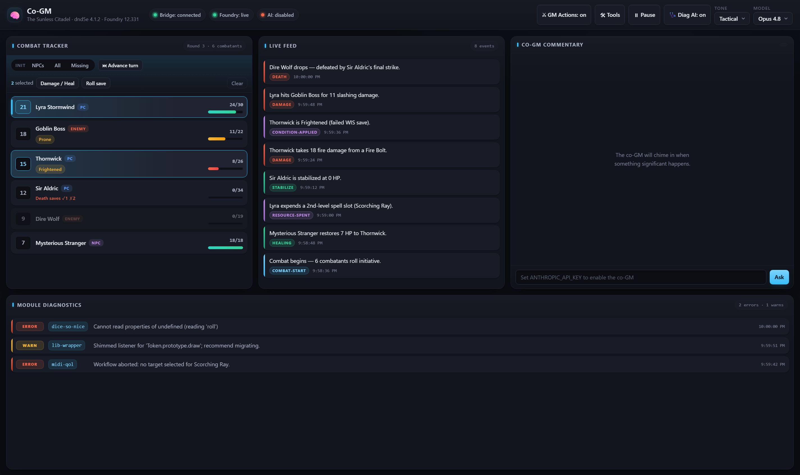
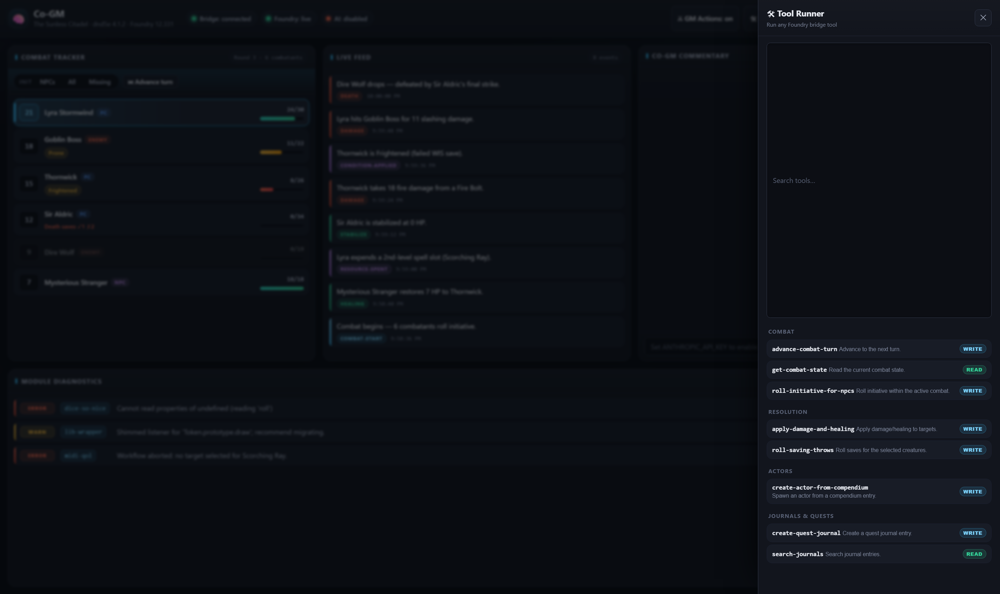
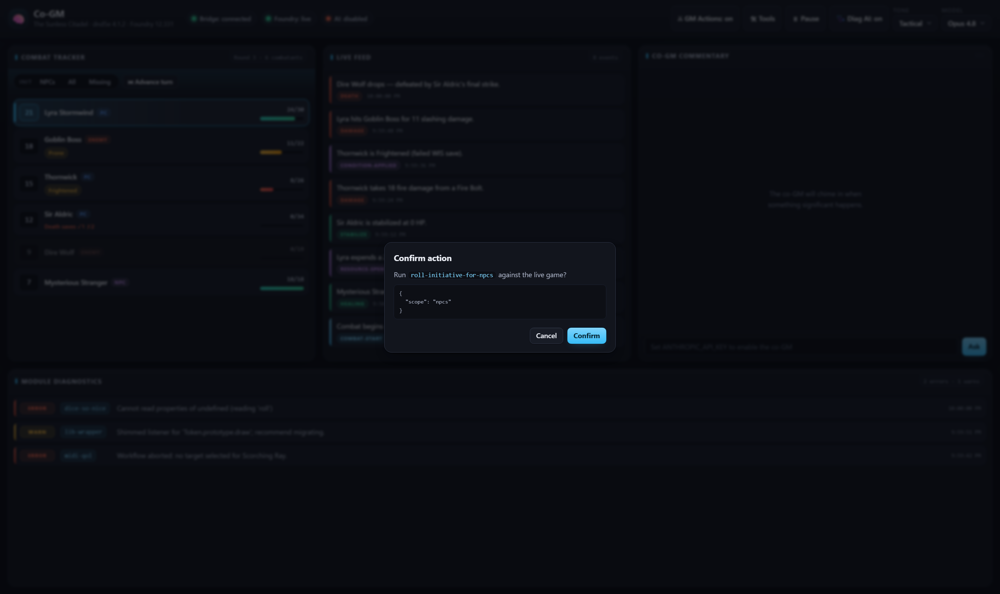
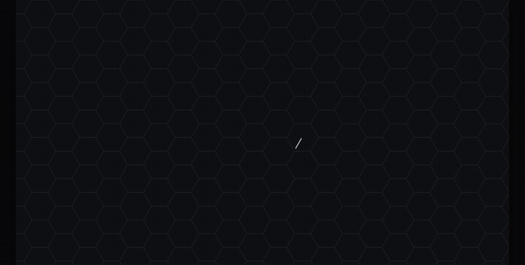

<p align="center">
  
</p>

<p align="center">
  <a href="https://github.com/Gnuminator/Foundry-VTT-MCP-Ai-Tool/actions/workflows/ci.yml"></a>
  <a href="https://github.com/Gnuminator/Foundry-VTT-MCP-Ai-Tool/releases/latest"></a>
  <a href="LICENSE"></a>
  
  
</p>

---

Foundry AI Tool lets Claude **see and act on** a live Foundry VTT game. It also gives the GM a
browser **dashboard** that watches the table in real time and lists Claude's guarded changes
with an Undo button, a **spoiler-safe page for the players**, and **Obsidian notes** of every
session.

Claude Desktop (or any [MCP](https://modelcontextprotocol.io) client) connects to the bridge and
gets GM-gated tools for actors, combat, scenes, compendiums, journals and more. The dashboard works
on its own too: **no AI client is needed** to use it. Built for **Foundry 14 with dnd5e 6**, and
currently shaped around a Curse of Strahd campaign.

> **New here?** GMs start with the **[GM guides](docs/gm/README.md)**. Players read the
> **[player guide](docs/player/README.md)**. Everything else is in the
> **[documentation index](docs/README.md)**.

<p align="center">
  
</p>

## What it does

- **AI access to the game.** 86 tools let Claude read characters, combat, scenes, journals,
  compendiums, chat and the session log, and act on them: roll for NPCs, apply damage, move tokens,
  add NPCs from compendiums, write journals. Most of these act at once and have no undo; keep
  Claude Desktop's tool approval on for them. The tools come in five sets (core, play, prep, build,
  admin) that you switch on per chat, so Claude only reads the ones the chat needs.
- **Guarded AI writes with undo.** New features change the game in three steps: plan, confirm with a
  diff, apply. Each feature has its own switch in the module settings (off by default). A change is
  refused if anything changed since the plan, is recorded, and can be undone from the dashboard.
- **Tarokka reading (Curse of Strahd).** Deal a reading with the built-in roll, or import one dealt
  in the `tarokka-reading` module. The cards are kept GM-only, outside Foundry's world data. Link
  each card to a journal page, scene or actor, and reveal a card to players with only the text you
  write.
- **Spoiler-safe player page.** `/player` is built by projection from what players can see in
  Foundry: hidden creatures never appear, unknown names read "Unknown creature", enemies show no HP
  numbers, and private, blind and GM rolls stay out.
- **Handouts.** Reveal a journal page to the players. It appears on the player page with GM secrets,
  inline rolls and links to unrevealed pages removed, and becomes readable in Foundry.
- **Play log and stats.** The GM's client records rolls (with a full breakdown), HP (credited to the
  roll that caused it, when it can tell), rests, combat, items and chat, per user. Stats per session
  and per PC.
- **Obsidian notes.** One note per play session, the change history, the Tarokka reading, stats,
  and an optional mirror of the Foundry world (PCs, NPCs, scenes, journals, items) with links back
  into Foundry. Notes you edit are never overwritten.
- **The dashboard.** Live combat tracker and event feed, combat controls, a tool runner for every
  tool, Recent Changes with Undo, a Tarokka drawer and play session markers.

## The parts

| Part                                      | What it is                                                                                 | Runs in           |
| ----------------------------------------- | ------------------------------------------------------------------------------------------ | ----------------- |
| **Foundry module** (`foundry-mcp-bridge`) | A GM-gated gateway inside Foundry: bridge handlers, the play recorder, the version adapter | a GM's browser    |
| **Bridge** (MCP server)                   | MCP tools, guarded writes, the GM-only bridge vault, the Obsidian renderer                 | Node.js           |
| **The dashboard**                         | The GM's control panel and the players' `/player` page                                     | Node.js + browser |

```text
  Claude / MCP client ──(MCP)──► bridge ──(socket)──► Foundry module ──► your game
                                   ▲  │
  The dashboard ──(control)────────┘  └──► Obsidian notes (one way)
```

> Architecture deep-dive: **[docs/dev/ARCHITECTURE.md](docs/dev/ARCHITECTURE.md)**.

---

## The dashboard

A live session control surface that runs in a browser tab on a second screen.



- **Live combat tracker:** initiative order, current turn, HP bars, conditions and death saves, in
  real time.
- **Live event feed:** damage, healing, deaths, conditions, spell slots and dice rolls with their
  breakdown, as they happen.
- **Recent Changes:** every guarded change, with Undo.
- **Play sessions:** Start and End session in the header; Obsidian notes follow these markers.
- **Tarokka drawer:** the reading (cards hidden until you choose to show them), links, reveals.
- **AI commentary (optional):** streaming call-outs and an Ask box. This uses the paid Anthropic API
  and only runs when an `ANTHROPIC_API_KEY` is set; everything else works without it.



**Run the game from the dashboard:** multi-select combatants and act on them as a group: roll
initiative for NPCs, advance the turn, apply damage or healing, roll saving throws.



**Tool runner:** every bridge tool behind a searchable, categorized form. Every parameter that names
something (an actor, a token, a journal page, a plan) has **Pick…**, a list of what exists now.



**Safe by default:** watching is always read-only; game-changing actions stay off until you flip the
**GM Actions** switch; every write asks for confirmation, a planned change shows its diff, and
destructive actions need a second confirmation.

> Full tour for GMs: **[docs/gm/dashboard.md](docs/gm/dashboard.md)**.

---

## Hosting and remote access

The bridge and the dashboard are decoupled, so they can run where it suits the table.

- **Loopback by default.** The bridge's Foundry link and the dashboard listen on `127.0.0.1` only.
  `FOUNDRY_LINK_HOST` / `DASHBOARD_HOST` open them to other interfaces; the dashboard refuses a
  non-loopback address without a `GM_DASHBOARD_TOKEN` of at least 32 characters, and answers only host names on its allowlist
  (`DASHBOARD_ALLOWED_HOSTS`).
- **Standalone bridge.** Run the bridge without Claude Desktop: `npm run bridge:standalone` (host and
  port injectable; Windows service scaffold in [`deploy/windows/`](deploy/windows/)).
- **Player vs GM split.** With a GM token (or a Cloudflare Access email allow-list) the GM surface
  needs GM credentials and everyone else gets the read-only player view. The player endpoints
  always project, even when a GM token is presented.
- **Home server.** The plan is to run Foundry, the bridge and the dashboard on an Orange Pi 5 Pro at
  home: see [docs/dev/PI-SETUP.md](docs/dev/PI-SETUP.md). Remote access templates (Cloudflare
  Tunnel and Access, Docker) are in [docs/dev/REMOTE-ACCESS.md](docs/dev/REMOTE-ACCESS.md) and
  [`deploy/`](deploy/); they are templates, not a one-click deploy, and the exposure method is
  settled during the Pi setup.

---

## MCP tools

86 tools in five sets. Each set is its own entry in Claude Desktop, with its own switch in the
**Search and tools** menu; all 86 tools are about 99,900 characters of definitions that Claude
would otherwise read at the start of every chat. The dashboard always has every tool. Details and
the full lists: [docs/reference/TOOL-SETS.md](docs/reference/TOOL-SETS.md).

| Set       | Tools | What it covers                                                                                                                           |
| --------- | ----- | ---------------------------------------------------------------------------------------------------------------------------------------- |
| **core**  | 22    | Look-ups (world, characters, scenes, tokens, combat state, journals, compendiums) and the change safety net: plan, apply, undo           |
| **play**  | 29    | Live play: tokens, initiative and turns, rolls, damage and healing, conditions, resources, rests, the party, chat, mood, map notes, loot |
| **prep**  | 20    | Prep and recaps: quests and journals, encounter budgets, Tarokka, handouts and the player view, session log, play stats                  |
| **build** | 7     | NPCs, monsters and items: from a compendium or from scratch, with features, attacks and spells                                           |
| **admin** | 8     | Modules and their errors, actor ownership, the Obsidian mirror                                                                           |

---

## Supported systems

- **Dungeons & Dragons 5th Edition** (dnd5e 6 on Foundry 14)

System-specific logic (creature indexing, stat extraction, filters) lives behind a registry and
adapter interface, so another system is an adapter away, but only the D&D 5e adapter ships today.

---

## Installation

### 1. Install the Foundry module

In Foundry VTT, **Add-on Modules**, **Install Module**, paste this manifest URL:

```text
https://github.com/Gnuminator/Foundry-VTT-MCP-Ai-Tool/releases/latest/download/module.json
```

Enable it in your world (requires Foundry **v14** with the dnd5e 6 system).

### 2. Set up the bridge (MCP server)

Requires Node.js 22+.

```bash
git clone https://github.com/Gnuminator/Foundry-VTT-MCP-Ai-Tool.git
cd Foundry-VTT-MCP-Ai-Tool
npm install
npm run build
```

Add the server to your Claude Desktop config (`claude_desktop_config.json`), one entry per tool
set, then restart Claude Desktop. Two of the five entries:

```json
{
  "mcpServers": {
    "foundry-mcp": {
      "command": "node",
      "args": ["/absolute/path/to/packages/mcp-server/dist/index.js"],
      "env": { "FOUNDRY_AI_TOOL_SETS": "core" }
    },
    "foundry-mcp-prep": {
      "command": "node",
      "args": ["/absolute/path/to/packages/mcp-server/dist/index.js"],
      "env": { "FOUNDRY_AI_TOOL_SETS": "prep" }
    }
  }
}
```

[`claude_desktop_config.example.json`](claude_desktop_config.example.json) has all five (core, play,
prep, build, admin). One entry without `FOUNDRY_AI_TOOL_SETS` serves all 86 tools, as before.

The bridge links the AI client and the Foundry module over local sockets (control channel on
`127.0.0.1:31414`; Foundry link on `31415`). Foundry must be open in a GM's browser with
the module active. For Obsidian notes, add `"FOUNDRY_AI_OBSIDIAN_DIR": "<your vault folder>"` to
the `env` of every entry.

**Windows PC with the bridge on a home server.** If the bridge runs on another machine, the
`FoundryMCPServer-Setup-vX.Y.Z.exe` installer from the release page is all a GM's PC needs: it
installs a portable Node.js and the client, asks for the bridge address (for now the server's
name on your private network, for example its Tailscale name; a Cloudflare route is planned) and
writes the five entries for you. Quit Claude Desktop first. It does not install Foundry, the
module or a bridge. Silent install: `/S /HOST=<name or IP>`. See
[docs/dev/DEPLOYMENT.md](docs/dev/DEPLOYMENT.md).

### 3. Run the dashboard

```bash
npm run dev:cogm              # → http://localhost:3000 (the player page is /player)
```

The dashboard works without an API key: live feed, combat tracker, tool runner, Recent Changes,
Tarokka and the player page all function. Only the optional AI commentary needs
`ANTHROPIC_API_KEY` (see `packages/cogm-dashboard/.env.example`). For the dashboard's Open in
Obsidian links, set `OBSIDIAN_VAULT_NAME` (or `FOUNDRY_AI_OBSIDIAN_DIR`) in
`packages/cogm-dashboard/.env`. To run it with Claude Desktop
closed, start the bridge standalone first: `npm run bridge:standalone`.

---

## Documentation

| Doc                                                     | What                                                                               |
| ------------------------------------------------------- | ---------------------------------------------------------------------------------- |
| [GM guides](docs/gm/README.md)                          | Getting started, the dashboard, asking Claude, session checklists, troubleshooting |
| [Player guide](docs/player/README.md)                   | What players see, what is recorded, which parts reach an AI                        |
| [Documentation index](docs/README.md)                   | Every folder: guides, developer docs, reference, plans, history                    |
| [ARCHITECTURE.md](docs/dev/ARCHITECTURE.md)             | The system from first principles: the wire contracts, GM-gating, guarded writes    |
| [REMOTE-ACCESS.md](docs/dev/REMOTE-ACCESS.md)           | Remote access setup and deploy templates                                           |
| [PI-SETUP.md](docs/dev/PI-SETUP.md)                     | Bringing up the Orange Pi home server                                              |
| [PLAN-B.md](docs/dev/PLAN-B.md)                         | The Pi is down on game night: Foundry on the admin's PC from last night's backup   |
| [CHANGELOG.md](CHANGELOG.md) · [CREDITS.md](CREDITS.md) | Releases · attribution                                                             |

---

## Attribution

Built on top of [foundry-vtt-mcp](https://github.com/adambdooley/foundry-vtt-mcp) by Adam Dooley (MIT).
The MCP server and Foundry module packages are derived from that upstream project; the dashboard
(`packages/cogm-dashboard`) is original work. Full attribution in [CREDITS.md](CREDITS.md).

---

<p align="center">
  
</p>

---

Foundry AI Tool is an independent project, not affiliated with or endorsed by Foundry Gaming LLC.
