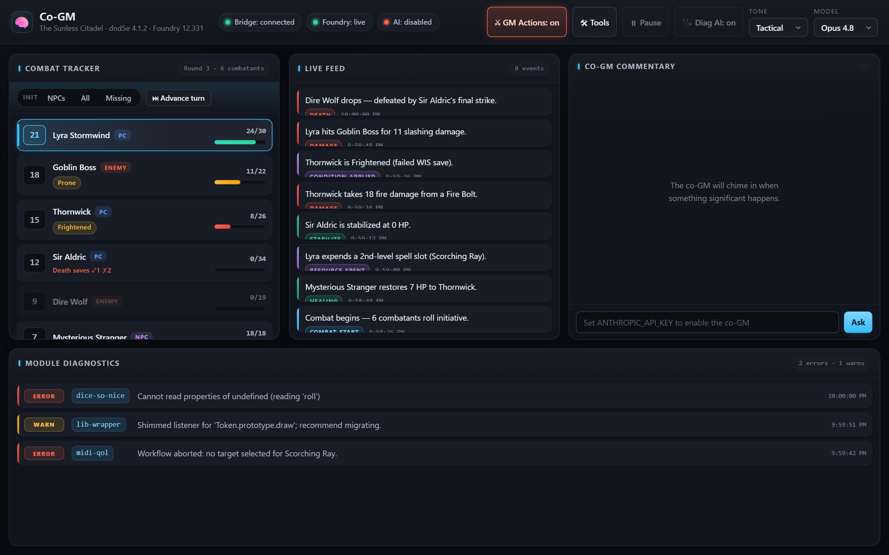
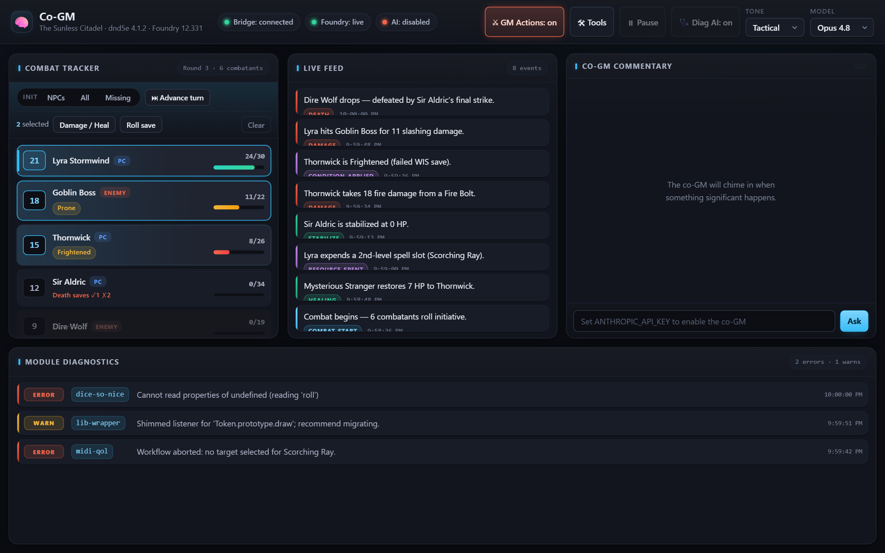
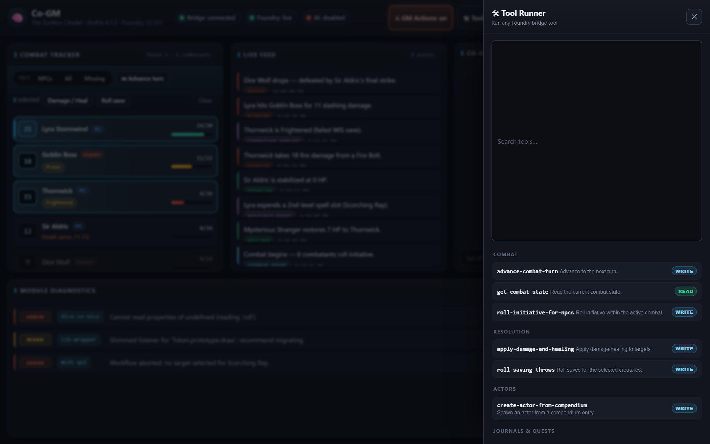
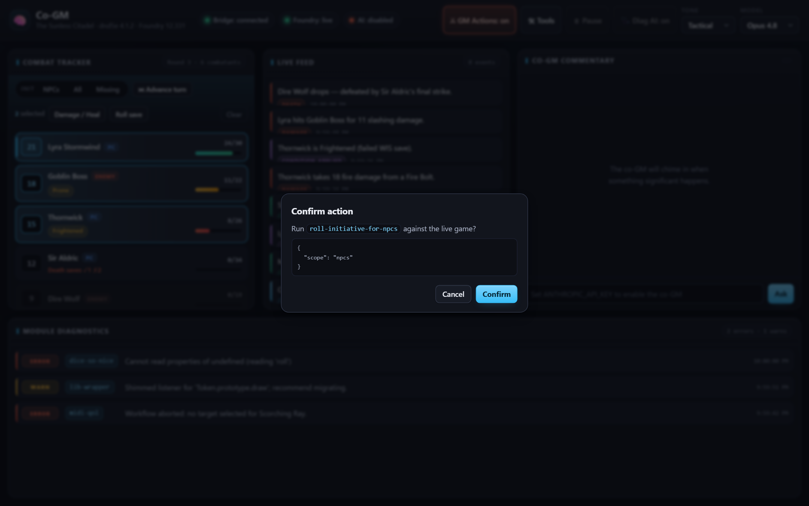
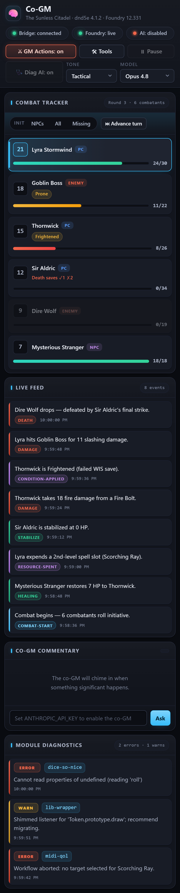

# The Co-GM Dashboard

A live, AI-assisted **co-GM screen** that runs in a browser next to Foundry VTT. It watches the
game as it happens — and now lets you **run the game from the dashboard**, too.



---

## What it can do

### See the whole table at a glance

- **Live combat tracker** — initiative order, current turn, HP bars, conditions, and death saves,
  all updating in real time.
- **Live event feed** — damage, healing, deaths, conditions, spell slots and more, color-coded by
  type as they happen.
- **Module diagnostics** — a running log of Foundry module errors/warnings so you catch a broken
  module mid-session, with an optional AI "likely cause & fix."

### An AI co-GM that watches with you

- **Streaming commentary** — tactical or narrative call-outs when something significant happens
  ("the Goblin Boss is bloodied and prone — press the attack").
- **Ask the co-GM** — type a question like _"who's in trouble?"_ and get an answer grounded in the
  current board state.
- **Whisper to chat** — send any comment straight into Foundry as a GM whisper with one click.

### Run the game from the dashboard



- **Click combatants to multi-select**, then act on them as a group.
- **Roll initiative** for NPCs / everyone / just the ones missing it, **advance the turn**, or jump
  to a combatant.
- **Apply damage or healing** and **roll saving throws** for the selected creatures.

### Do (almost) anything the bridge can do



- A built-in **Tool Runner** exposes _every_ Foundry MCP tool behind a simple form: spawn NPCs and
  monsters from compendiums, **generate AI battlemaps**, set the scene's mood/lighting, create quest
  journals, drop loot, manage tokens, and more.
- Tools are grouped by category and searchable, so you can find the one you need fast.

### Safe by default



- Watching the game is **always read-only**.
- Game-changing actions stay off until you flip the **GM Actions** switch.
- **Every write asks for confirmation**, and **destructive actions** (like deleting tokens) require
  an explicit second confirm — no accidental table-wipes.

### Works on a tablet or second screen



The layout adapts down to phone width, so you can keep it open on a tablet beside you at the table.

---

## Running it

The dashboard is a small standalone app that talks to the **Foundry MCP Bridge** module (so Foundry
must be open with the bridge connected).

```bash
cd packages/cogm-dashboard
# put your Anthropic API key in .env (ANTHROPIC_API_KEY=...) to enable the AI co-GM
npm run dev          # → http://localhost:3000
```

Without an API key the live feed, combat tracker, diagnostics and GM Actions all still work — only
the AI commentary is disabled.
