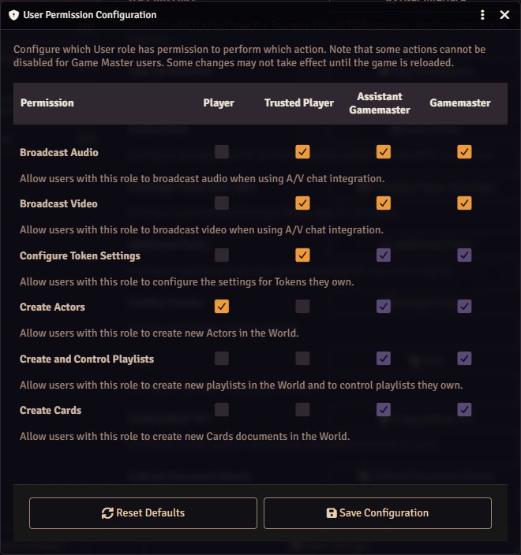
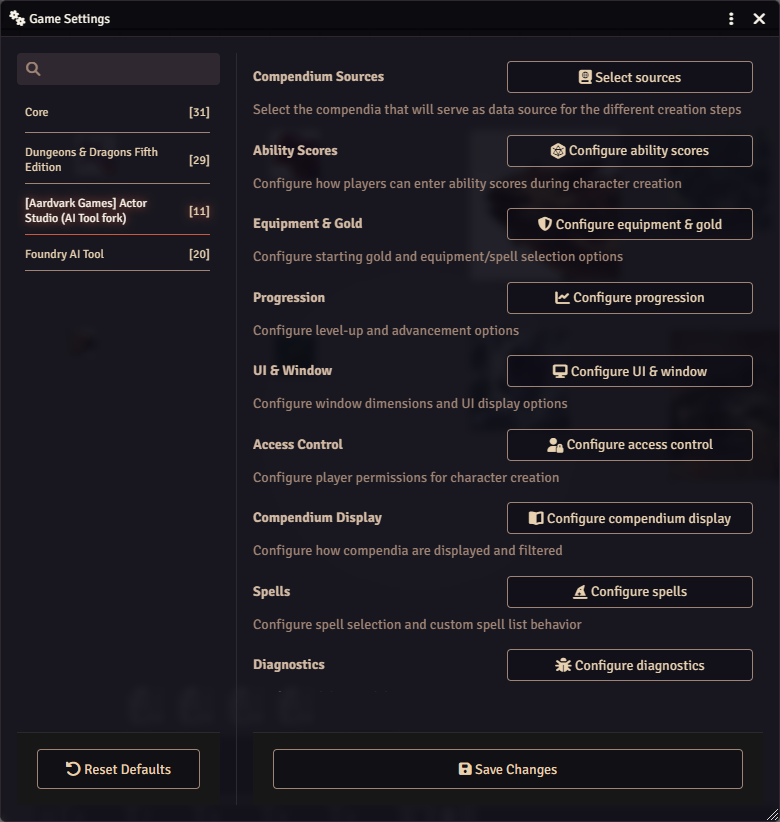
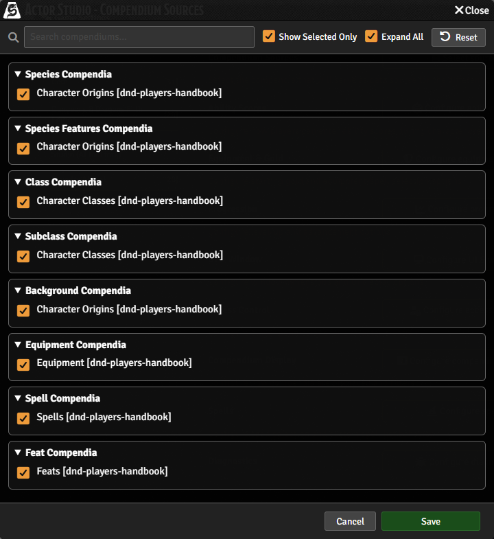

# Prepare session 0

At session 0 each player makes a level-1 character in Foundry from home, with the builder
**Actor Studio** (the player side is in [Make your character](../player/make-a-character.md)).
Out of the box players can't do that: they may not create characters, and Actor Studio reads the
older free rules instead of the 2024 Player's Handbook. This page sets both up, once, a week or so
before session 0. It takes about 30 minutes.

**On our server part of it is done already.** The admin has already set up character creation:
players may create characters, Actor Studio gives starting equipment, and it takes that equipment
from the Player's Handbook. So step 2 is a check, and so are the equipment settings in step 3.
The other settings in step 3 may still be the defaults: compare each window with the picture and
the table, and set what differs. The ability score method (step 3, item 2) is your choice. Steps 1
and 4 are yours to do.

All of it is normal Foundry settings, done as Gamemaster in your browser. Nothing here needs the
command line or Claude. What session 0 itself holds is yours to plan; [Prep and
expectations](prep-and-expectations.md) has an agenda you can change.

## 1. One user per player

1. Press **Esc** and choose **User Management** (or Settings tab, **User Management**).
2. For each player, click **Create Additional User**, type their name in **User Name**, a
   password in **Password**, and keep the role **Player**.
3. Click **Save and Return**.

Send each player their user name and password privately (a Discord direct message), with the link
to [Join the game](../player/join.md).

## 2. Let players create characters (a check on our server)

1. Settings tab, **Game Settings**, category **Core**, the **User Permissions** button.
2. In the row **Create Actors**, tick the **Player** column.
3. Click **Save Configuration** (only if you changed something).

Without this, Actor Studio tells a player "User requires the 'Create New Actors' permission".

## 3. Point Actor Studio at the 2024 Player's Handbook (partly done on our server)

Settings tab, **Game Settings**, the category **[Aardvark Games] Actor Studio (AI Tool fork)**.

1. **Compendium Sources**, **Select sources**. The window opens with **Show Selected Only**
   ticked, so it lists only the packs already in use: untick it to see them all. Tick only the
   packs of the Player's Handbook module (their names end in `[dnd-players-handbook]`):

   | Row                                           | Tick              |
   | --------------------------------------------- | ----------------- |
   | Species Compendia, Species Features Compendia | Character Origins |
   | Background Compendia                          | Character Origins |
   | Class Compendia, Subclass Compendia           | Character Classes |
   | Spell Compendia                               | Spells            |
   | Feat Compendia                                | Feats             |
   | Equipment Compendia                           | Equipment         |

   Untick the D&D 5e system's own packs (the older free rules), or every list shows each choice
   twice. Click **Save**, then **Yes** when Foundry asks to reload.

   

2. **Configure ability scores**: tick the method you and the players agreed on (**Allow standard
   array**, **Allow point buy**, **Allow rolling**, **Allow manual input**), so the builder offers
   only that one. If you haven't had the talk yet ([The ability score
   talk](prep-and-expectations.md#the-ability-score-talk)), you can change this on the night before
   the players open the builder. Manual input lets a player type any number; leave it off unless
   you want that.
3. **Configure equipment & gold**: **Enable Equipment Selection** is ticked.
4. **Configure spells**: tick **Enable Spell Selection**.

Leave usage tracking off: our copy of Actor Studio has it off for everyone.

Our table keeps to the 2024 Player's Handbook. If you ever allow more (for example older species
in our own content module), tick those packs too and tell the players.

## 4. Give the join page the campaign look (optional)

The join page is the first screen your players see when they open the game link. One click gives
it The Veil: the castle in the mist as the background picture and a lamplit line above your world
description.

1. Settings tab, **Game Settings**, category **Foundry AI Tool**, the **Choose join page look**
   button.
2. Keep or change **The lamplit line** (one short line).
3. Leave **Use The Veil picture as the world background** ticked, or untick it to keep your own
   picture.
4. Click **Apply The Veil**.

Your description text stays as it is. **Back to Foundry's look** in the same window removes the
line and the picture again. If you later save the description in **Edit World** and the line
disappears or loses its colours, open the window again and apply it.

## 5. Try it as a player

Make one character yourself as a player, so you know what they see and it works before the night.

1. In User Management, make a user called **Test Player** (role Player).
2. Open the game in a private browser window and log in as Test Player.
3. Follow [Make your character](../player/make-a-character.md) to the end.
4. As GM, look at the character's sheet with the checklist in step 10 of that page, then delete
   the character and the Test Player user.

## On the night

An agenda for the whole night, from the tech check to the wrap up: [Prep and
expectations](prep-and-expectations.md#a-session-0-agenda-you-can-change).

- Post the link to [Make your character](../player/make-a-character.md) in Discord, plus your
  answers: which ability score method, which options are allowed, anything about the campaign.
- Players build at the same time; it takes them about 45 minutes. Stay in voice for questions.
- When a player says they are done, open their sheet and go through the checklist in step 10 with
  them. The most common miss: a choice skipped with **Next** (a missing skill or spell). Fix it by
  hand, or delete the character and let them redo it.
- Check each player picked their character in **User Configuration** (the Players list shows
  `Name [Character]`).
- Add portraits: players can't upload pictures, so they send them to you. Open the sheet, click
  the portrait and pick the image.

## Afterwards

You can untick **Create Actors** for players again; nobody needs it until a character dies. When
one does, see [When a character dies](death-and-new-characters.md).
