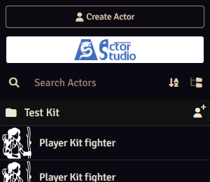
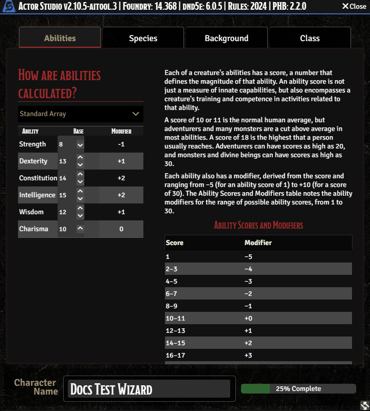
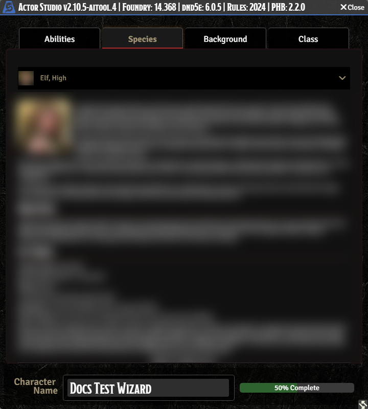
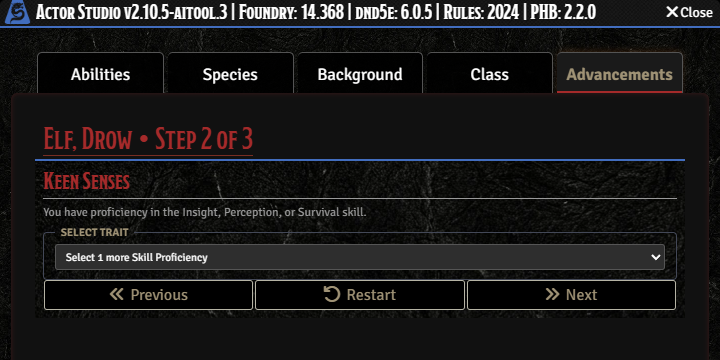
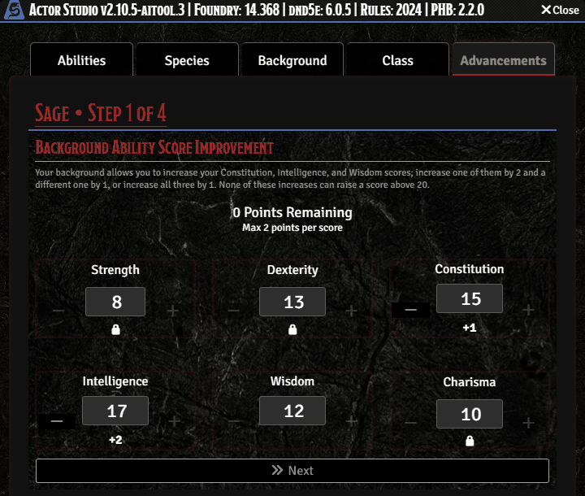
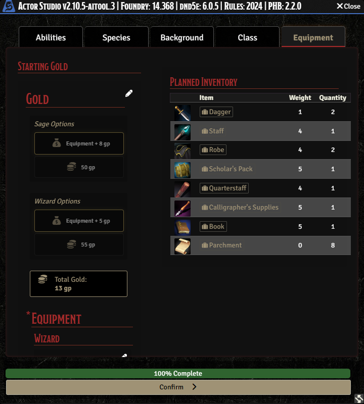
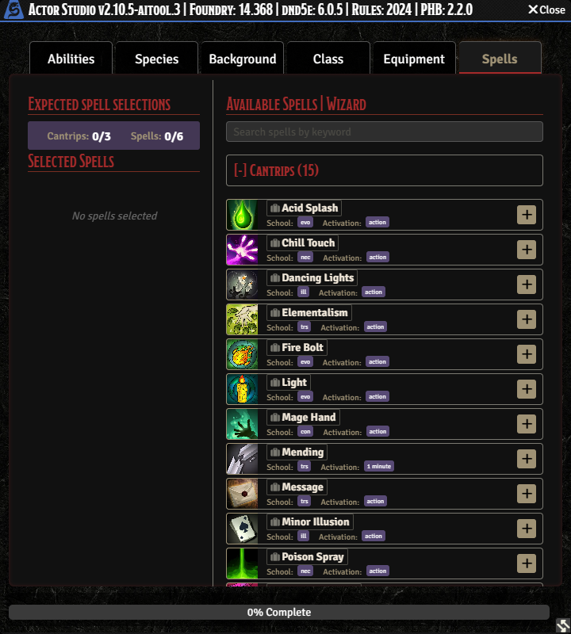
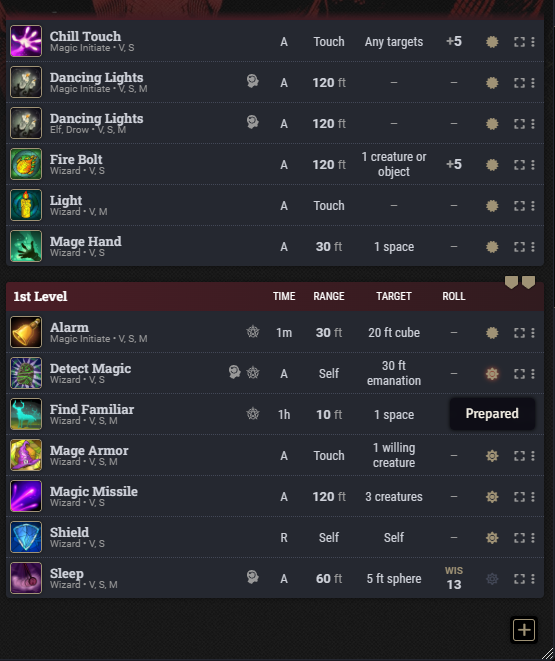
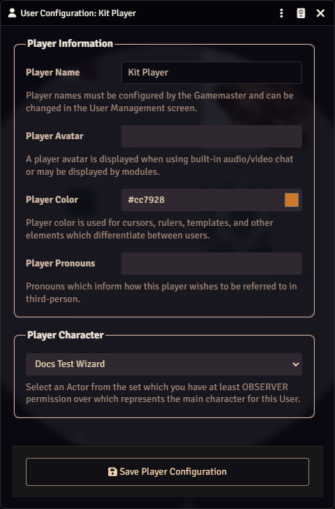

# Make your character

This page walks you through making a level-1 character in Foundry, the way we do it at session 0.
It takes about 45 minutes the first time. You need to be logged in first: see
[Join the game](join.md).

We use **Actor Studio**, a character builder inside Foundry. It asks the same questions as the
2024 Player's Handbook, in the same order, and fills in your character sheet for you. You can't
break anything: if it goes wrong, the GM deletes the character and you start again.

Checked on Foundry 14, D&D 5e system 6, Actor Studio 2.10.5 and the 2024 Player's Handbook module
2.2.0 (October 2026).

## Before you start

Ask your GM, or read the session 0 message, for:

- **How you get your ability scores.** The standard array (15, 14, 13, 12, 10, 8), point buy, or
  rolling. The GM may ask the table first: the standard array gives balanced characters, rolling
  can give very strong or very weak ones. The builder only offers the methods the GM switched on.
- **Which options are allowed.** Usually everything in the 2024 Player's Handbook; our table keeps
  to it. Some tables add or remove species, backgrounds or classes.
- **Anything special about the campaign.** Some campaigns suggest backgrounds or character ideas.

Have a rough idea of your class, species and background. You don't need to know the rules by
heart: each choice in the builder shows its description.

## 1. Open Actor Studio

1. In the sidebar on the right, click the **Actors** tab (the person icon).
2. At the top of that tab, click the **Actor Studio** button (its logo, under **Create Actor**).

The first time you log in, an Actor Studio welcome window opens by itself. Tick **Don't show this
message again** and close it.

The builder window has the tabs **Abilities**, **Species**, **Background** and **Class**, a
**Character Name** box at the bottom and a bar that says how far you are.

> If you get the message "User requires the 'Create New Actors' permission", tell the GM. Players
> can't make characters until the GM allows it (see the GM's [Prepare session 0](../gm/prepare-session-0.md)).

## 2. Abilities

1. Open the **Ability Generation Method** list and pick the method your GM chose.
2. Put your best scores where your class needs them. With the standard array, use the small arrows
   next to each score to move the numbers around. For example, a wizard wants the highest score in
   Intelligence, a fighter in Strength or Dexterity.

Don't add anything for your background yet: the builder asks for that later.

## 3. Species

Open the **Species** list and pick one. Its description and traits show below.

Some species appear more than once, one entry per lineage: Elf (Drow, High, Wood), Gnome (Forest,
Rock) and Tiefling (Abyssal, Chthonic, Infernal). The list shows the lineage after the name, for
example "Elf, High". Pick the one you want.

## 4. Background

Open the **Background** list and pick one. The box shows what it gives you: which ability scores it
can raise, a feat, two skills, a tool and starting equipment.

## 5. Class

Open the **Class** list and pick one. The page shows the class's main ability, hit points, saving
throws, skills to choose from, and starting equipment. In the 2024 rules you pick a subclass at
level 3, not now.

## 6. Name and create

1. Type your character's name in **Character Name** at the bottom.
2. Click **Create Character**.

Your character now exists (you can see it in the Actors tab), and the builder moves on to the
**Advancements** tab. Up to here you could change anything freely. From here, if you made a wrong
choice, finish anyway and tell the GM.

## 7. Advancements: answer each step

The builder walks through what your species, background and class give you, one step at a time
("Step 2 of 3"; the number of steps depends on your choices). Some steps only tell you what you
get; click **Next**. Others ask you to choose.

**Pick everything a step asks for before you click Next.** The Next button works even when you have
picked nothing, and then your character simply misses that choice. Look for text like "Select 1
more Skill Proficiency": it must be gone before you click Next. **Previous** goes back a step.

The steps you will see, roughly in this order:

- **Species traits:** for example a skill to choose (an elf picks Insight, Perception or Survival),
  and a spellcasting ability for species magic.
- **Background ability scores:** raise the three listed scores: one by 2 and another by 1, or all
  three by 1. Click **+** next to the scores until it says **0 Points Remaining**.

  

- **Languages, skills and tools** from your background.
- **The background's feat.** Some feats ask for more choices. Magic Initiate, for example, asks for
  a level-1 spell and two cantrips: pick them all. Its spell picker can show the same spell several
  times, once per book; pick the copy from the 2024 Player's Handbook, or ask the GM.
- **Class:** hit points, saving throws, **skills to choose** (most classes pick two), weapon and
  armour training, and your level-1 class features.

## 8. Equipment

Next comes the **Equipment** tab.

1. Under **Starting Gold**, pick one option for your background and one for your class: the
   equipment plus a little gold, or only gold.
2. The **Planned Inventory** on the right shows what you get.
3. Scroll down in the left column. Click each item and each gold amount until all of them are
   green. The bar at the bottom reaches **100% Complete**.
4. Click **Confirm**.

## 9. Spells (spellcasters only)

If your class casts spells at level 1, the **Spells** tab opens. At the top it says how many you
may pick, for example "Cantrips: 0/3, Spells: 0/6".

1. Click **[+] Cantrips** to open the list, then the **+** at the right of each cantrip you want.
2. Do the same under **[+] Level 1**.
3. When both counters are full, click **Finalize Spells**.

Your character sheet opens.

## 10. Check your sheet

Look over the sheet before you call it done. Ask the GM if anything looks wrong.

- [ ] The level is 1, and the class, species and background are right.
- [ ] Hit points: your class's hit die at its highest, plus your Constitution modifier (a wizard
      with Constitution 14 has 8).
- [ ] Skills: the ones from your background, your class (usually two) and your species, if it gives
      one. A missing skill means a step was skipped.
- [ ] Spells: every cantrip and spell you picked, including those from a feat such as Magic
      Initiate.
- [ ] Equipment and gold are on the **Inventory** tab.

**Prepare your spells.** Classes that prepare spells (for example wizard, cleric, druid) start with
none prepared. On the **Spells** tab the card at the top says how many you may prepare. Click the
small button at the right end of a spell's row to prepare it; hover over it to see whether a spell
is prepared ("Prepared" or "Not Prepared").

**Know your character.** Before the first session, read through your features and spells once.
Knowing what your character can do is your job, so the game doesn't stop to look things up.

## 11. Make it your character

Foundry needs to know which character is yours, so it uses it for your rolls and tokens.

1. In the **Players** list at the bottom left, right-click your own name and choose **User
   Configuration**.
2. Under **Player Character**, pick your new character.
3. Click **Save Player Configuration**.

The Players list now shows your name with the character's name in brackets.

## 12. A portrait (optional)

Players can't upload pictures to Foundry. Send your picture to the GM on Discord, and the GM adds it
as your portrait and token.

## If something goes wrong

| What happened                                      | What to do                                                                                               |
| -------------------------------------------------- | -------------------------------------------------------------------------------------------------------- |
| "User requires the 'Create New Actors' permission" | The GM has to allow players to make characters. Tell them.                                               |
| A list is empty, or shows only a few choices       | The builder is not set to the right books. Tell the GM.                                                  |
| You closed the builder halfway                     | Your character may exist half-made in the Actors tab. Ask the GM to delete it, then start again.         |
| You skipped a choice with Next                     | Finish, then tell the GM what is missing. The GM can add it, or delete the character so you can redo it. |
| Equipment stays at 50%                             | Scroll down in the left column and click the gold amounts too, until everything is green.                |

## What to ask your GM

- Which ability score method, and which books and options are allowed.
- How your character knows the others, or why they are travelling together.
- Anything about the world your character would know.

What the tool records while you play, and how to have it removed: [player guide](README.md).
